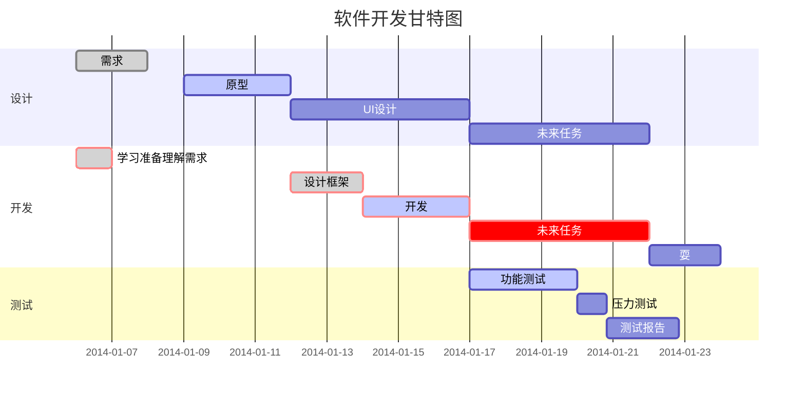

# MarkDown语法
## 标题
换行  末尾两个空格  
*斜体文本*  
**粗体文本**
<!-- *** 分割线 -->
***
~~删除线~~  
<u>下划线</u>  
后缀[^脚注]  
+ 第一条
- 第二条
* 第三条  
1. 第一条
    + 子列
    + 子列
2. 第二条  
> 区块  
>> 区块第二层  

`printf()` 函数 反引号 
    
    四个空格 代码块
    public static void main(){
      System.out.println();
    }

```java
// 三个反引号指定语言
public static void main(){
      System.out.println();
    }
```
[链接](https://www.baidu.com)   
  

|  表头   | 表头  |
|  ----  | ----  |
| 单元格  | 单元格 |
| 单元格  | 单元格 |  

| 左对齐 | 右对齐 | 居中对齐 |
| :-----| ----: | :----: |
| 单元格 | 单元格 | 单元格 |
| 单元格 | 单元格 | 单元格 |

<!-- 不在 Markdown 涵盖范围之内的标签，都可以直接在文档里面用 HTML 撰写 -->
使用 <kbd>Ctrl</kbd>+<kbd>Alt</kbd>+<kbd>Del</kbd> 重启电脑

**文本加粗**  
\*\* 正常显示星号 \*\*  



$$
\mathbf{V}_1 \times \mathbf{V}_2 =  \begin{vmatrix}
\mathbf{i} & \mathbf{j} & \mathbf{k} \\
\frac{\partial X}{\partial u} &  \frac{\partial Y}{\partial u} & 0 \\
\frac{\partial X}{\partial v} &  \frac{\partial Y}{\partial v} & 0 \\
\end{vmatrix}
$$

